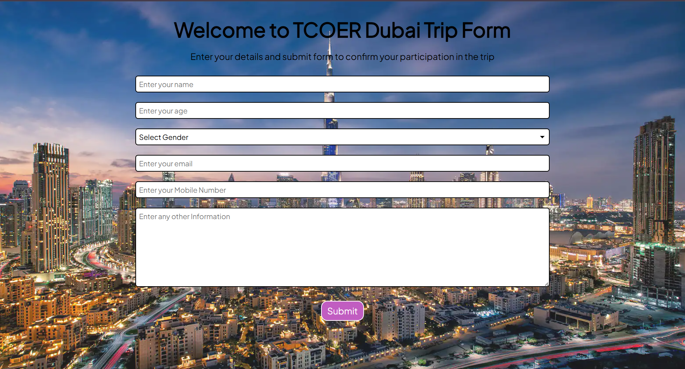

# 🌍 PHP Travel Form

This is a simple PHP-based travel registration form built as a beginner project. It allows users to submit their personal details for a trip, which are then stored in a MySQL database. The project demonstrates full-stack development using **HTML, CSS, JavaScript, PHP**, and **MySQL**.

---

## ✨ Features

- Responsive and user-friendly form
- Frontend validation using JavaScript
- Backend validation using PHP
- Secure input handling using prepared statements
- Success and error feedback messages
- Custom styling using CSS
- Simple and clean code structure

---

## 🛠 Technologies Used

- PHP
- HTML5 & CSS3
- JavaScript
- MySQL
- XAMPP (local development)

🙋‍♀️ Author
Purva Jadhav